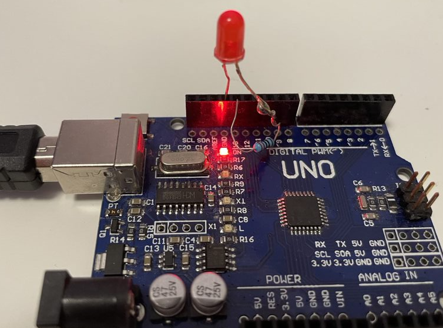

# OnAir

This will work on plain arduino (using on board led) or with external LED connected to pin 13 as described here
[Arduino example](https://www.arduino.cc/en/Tutorial/BuiltInExamples/Blink)

```c
int incomingByte = 0; 

void setup() {
  Serial.begin(9600); 
  pinMode(13, OUTPUT);
  
  digitalWrite(13, LOW);
}

void loop() {
  if (Serial.available() > 0) {
    incomingByte = Serial.read();
    if(incomingByte != 48){
      digitalWrite(13, HIGH);   
    }else
    {
      digitalWrite(13, LOW);   
    }
    
    Serial.println("OK");
  }
}
```





